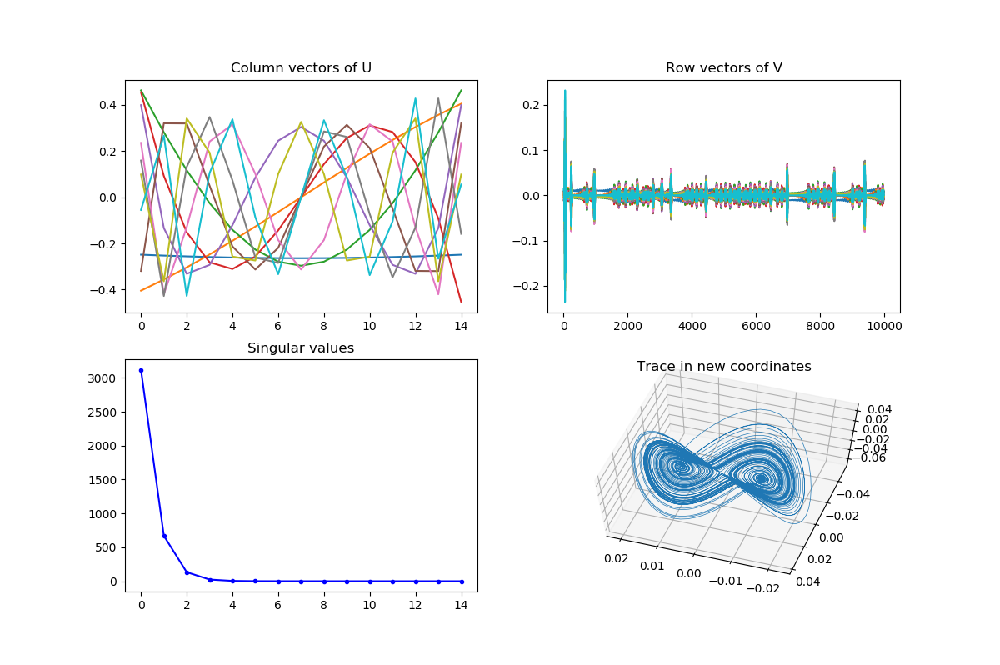

# Data-Driven Dynamical Systems: Dynamic Mode Decomposition and Koopman Operator

This is a very interesting topic I learned recently, which use a data-driven method to analyze the dynamical systems. All thanks to my advisor Dr. Liu who recommended a paper which really draw my attention and interest:

> Avila, A. M., and I. Mezić. "Data-driven analysis and forecasting of highway traffic dynamics." Nature Communications 11.1 (2020): 1-16.

This paper utilized Koopman mode decomposition to analyze the highway dynamics in a fully data-driven fashion, which in some sense can be interpretable.

This article will introduce the techniques used by the paper including dynamic model decomposition (DMD) and Koopman analysis. I strongly recommend the following websites and YouTube channels and I really appreciate Professor Steve Brunton and his collaborators who have explained their works clearly, easy to understand through all kinds of techniques including their amazing YouTube channels.

YouTube channels of Steve Brunton: `https://www.youtube.com/channel/UCm5mt-A4w61lknZ9lCsZtBw`

YouTube channels of Nathan Kutz: `https://www.youtube.com/channel/UCoUOaSVYkTV6W4uLvxvgiFA`

Website for DMD book: `http://dmdbook.com/`

Website for the online course (inferring structures of complex systems): `https://faculty.washington.edu/kutz/am563/page1/page15/am563.html`

These are amazing materials, very easy to understand for engineering students.

## Dynamical Systems

Almost all the real-world systems evolving with time can be regarded as a dynamical system. Let $x$ be the representation of the system state, which can be a vector with very high dimensions; the dynamical systems can be abstracted as:

$$\frac{dx}{dt}=f(x, u, t, \beta)$$

where $u$ can be the controlled variable, $\beta$ is the parameters. The function $f(\cdot)$ is named as *dynamics*. The traditional method to analyze the dynamical system is to establish the model to represent the dynamics. For example, Newton's second law is one of the modeling methods. However, using the traditional way, the dynamical systems can be very hard to analyze due to the following challenges:

* Unknow dynamics
* Nonlinear
* High-dimensionality
* Noise or even missing data
* Chaos, transient
* Uncertainty

Therefore, sometimes a data-driven method might be preferable to the traditional method by establishing models, and sovling and analyzing the models. Dynamical model decomposition (DMD) is such a method that does not require knowledge but only the data to analyze the dynamical systems using a linear approximation.

Before we go to the details of the DMD and Koopman analysis which could be regarded as an extension, here we recap the analysis for a linear system.

The discrete linear system can be written as:

$$x_{t+1}= Ax_t$$

With an initial state $x_0$, the $x_t$ can be simply solved as:

$$x_{t}=A^t x_0$$

Apply the eigenvalue decomposition to the matrix $A$: $A=W\Lambda W^*$, where $WW^*=I$ and $\Sigma$ is a diagonal matrix. The the $x_t$ becomes:

$$x_t=W\Lambda^tW^* x_0$$

where the matrix $W$ remains unchanged and only the diagonal matrix changes exponentially over time. The magnitude of the eigenvalue tells us how the corresponding *mode* delay or grow over time while the angle of the eigenvalue indicates the frequency of the mode. An eigenvalue with a magnitude larger than $1$ will lead the system to be unstable.

Later in DMD, we will show that what DMD does is essentially to approximate the dynamic system using a linear system and decompose the state to a series of modes associated with a spatial-temporal pattern and eigenvalue indicating the evolving of the pattern.

## Dynamic Mode Decomposition

As we stated before, DMD is to use a linear approximation (with respect to least square error) for a dynamic system and then decompose the state to a series of *modes* associated with a particular spatial-temporal pattern under a fixed frequency and delay or growth rate.

Let $X$ be the observation of the system from $1:t-1$ and $X'$ be the observation of the system from $2:t$.

$$X=[x_1, x_2,...,x_{t-1}]\quad\quad X'=[x_2, x_3,...,x_t]$$

Then the transition $A$ can be inferred as:

$$X'=AX \rightarrow A=X'X^\dagger$$

where $X^\dagger$ is the pseudo-inverse of the matrix. With matrix $A$ and we can find the eigenvalue and eigenvectors of the matrix and then transform the state $x$ to the coordinates of the eigenvectors. This is called *exact DMD*.

However, if the dynamical system has a very high dimension, then matrix $A$ will be a very large matrix, which is a $n$ by $n$ matrix where $n$ equals to the dimension of the systems. To deal with this issue, the following algorithm find the eigenvalue and eigenvectors directly without performing the eigendecomposition for the entire matrix $A$. The intuition is that the eigenvalues and eigenvectors has much less dimension than the original matrix.

Here is the algorithm:

1. Find the singular value decomposition of matrix $X$: $X=U\Sigma V^*, X'=AU\Sigma V^*$;
2. Project the matrix $A$ to the $U$ matrix (SVD of $X$) and get $\tilde{A}$: $\tilde{A}=U^*AU=U^*X'V\Sigma^{-1}$;
3. Apply eigendecomposition to the $\tilde{A}$: $\tilde{A}W=W\Lambda$;
4. Project back to original space to get the base of the *mode*: $\Phi=X'V\Sigma^{-1}W$.

**Comments for the algorithm**:

> * The first step is to conduct an SVD for the matrix $X$. Almost all the high dimensional matrix have some certain low-rank properties (Eckart-Young theorem).
> * Project the matrix $A$ to linear space expanded by $U$ is the key step of the algorithms, which essentially projects the dynamics (transition matrix) to the bases of $U$, which are composed of the dominant singular vectors (aka, principle components). In other words, $\tilde{A}$ is about how the dominant singular vectors evolve with time.
> * The reduction of the calculation is also due to the second step, where the dimension of $\tilde{A}$ is determined by the time horizon instead of the dimension of the systems. We can further reduce the calculation by using the truncated SVD, which is usually what we will do.

Then the $X_t$ can be decomposed as:

$$\hat{X}_t = \Phi \Lambda^t b_0=\sum_i \phi_i\cdot b_0 \cdot \lambda_i^t$$

where $b_0$ is determined by the initial state.

Then if we look at the decomposition results, DMD can somehow be regarded as a combination of singular value decomposition or principle component analysis (they are very closely related) and the Fourier analysis. The results include different modes associated with space-temporal pattern (mode: $\phi_i$), frequency and decay/growth rate (determined by the eigenvalues $\lambda_i$). Therefore, DMD is a very powerful technique to analyze periodic or quasi-periodic systems.

## Examples of DMD

Here is an example for the dynamic model decomposition and comparison with PCA (SVD).

## Koopman Theory

## Time-Delay Embeddings

Time-delay embedding is a very powerful method to analyze the nonlinear system. Here we will use Lorentz attractor as an example to show how the time-delay embedding can be applied to analyze the nonlinear systems and how a "high-dimensional" time-delay embedding can naturally work as a Koopman operator.

