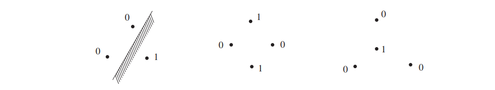
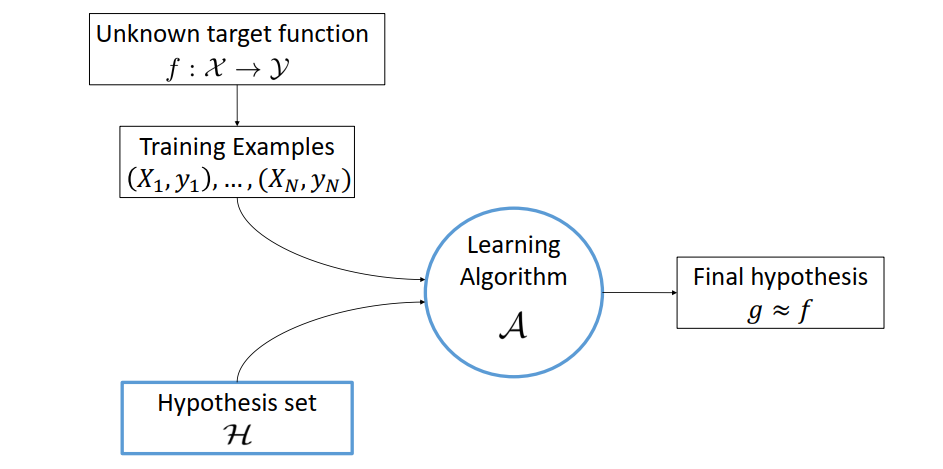
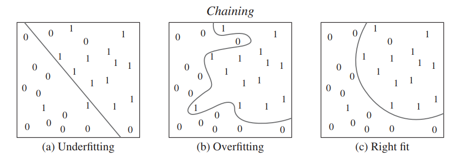

# VC Dimension and Statistical Learning Theory

好久好久没有写个总结也好久好久没具体读点儿书了，最近准备prelim exam正好把之前学的最不清楚的一些地方重新温习一下，今天的主要内容是第一学期上的一门课主要关于Machine Learning的一些内容。Neda上的这门课整体上偏向于Machine Learning比较基础入门的理论部分，这一部分也是当时最没听懂的部分以至于会看slides也没能完全理解，于是就找了一个参考文献简单看了一下：

> Vershynin, R. (2018). High-dimensional probability: An introduction with applications in data science (Vol. 47). Cambridge university press.

就我自己的观点而言，machine learning的发展实际应用价值上是远大于其理论价值的，特别是神经网络的大规模应用。今天介绍的VC dimension以及在statistical learning theory里面的简单应用则是对于machine learning比较基础的理论分析。简单概括这个文章的主要内容：VC dimension用于衡量一个布尔函数的复杂程度，进而可以被用于bound binary classification problem下in-sample error和out-of-sample error之间的差别，简单阐述了machine learning中一个基本的问题即多少数据才能得到满足要求的learning的结果。

## VC Dimension

### Definition of VC Dimension

Vapnik-Chervonenkis (VC) dimension 用于衡量布尔函数的复杂度， 布尔函数定义为从将定义域空间中的点映射到0或者1的函数： $\mathcal{F}:\{f:\Omega \rightarrow \{0, 1\}\}$。

**VC Dimension** 对于定义在一个空间$\Omega$中的一类的布尔函数$\mathcal{F}$，我们称空间中的一个子集$\Lambda \in \Omega$ is *shattered* (“打散”) by $\mathcal{F}$， 如果对于任意函数$g:\Lambda \rightarrow \{0,1\}$， 在给定的布尔函数集合 $\mathcal{F}$ 中可以找到$f\in \mathcal{F}$在子集$\Lambda$中和$g$有相同的映射关系。这一类布尔函数$\mathcal{F}$ 的 VC dimension，$\text{vc}(\mathcal{F})$定义为这类布尔函数能够shatter的子集$\Lambda$的最大元素个数。换句话说，对于超出这类布尔函数集合$\mathcal{F}$的VC dimension的$n$，对于任意$n$个元素的子集$\Lambda\in \Omega$，存在一个定义在这个子集$\Lambda$上的映射函数$g$，我们无法在$\mathcal{F}$中找到一个函数$f$使得他与$g$在$\Lambda$有相同的映射关系。

虽然很尽力的翻译成中文，但是还是读起来非常奇怪，这里是英文原文：

**VC Dimension** Consider a class $\mathcal{F}$ of Boolean functions on some
domain $\Omega$. We say that a subset $\Lambda \in \Omega$ is *shattered* by $\mathcal{F}$ if any function $g:\Lambda \rightarrow \{0,1\}$ can be obtained by restricting some function $f\in \mathcal{F}$ to $\Omega$. The VC dimension of $\mathcal{F}$, denoted $\text{vc}(\mathcal{F})$, is the largest cardinality of a subset $\Lambda$ shattered by $\mathcal{F}$.

这个定义还是有点抽象的，我们这里举一个简单的例子，我们把空间$\Omega$定义为$\mathbb{R}^2$, $\mathcal{F}$是所有的半平面，那么对于下图第一个例子，我们可以用$\mathcal{F}$ shatter 这三个点出现的所有的 $0$ 和 $1$ 组成的不同的patterns，所以半平面$\mathcal{F}$的VC dimension是大于等于$3$的，进一步可以验证，对于四个点的情形，我们无法任意的四个点使得半平面能够完全将其shatter的，所以对于定义在$\mathbb{R}^2$上的半平面而言，VC dimension为$3$。

## Statistical Learning Theory

### Learning Diagram and Classification Problem

下面的图表给出了statistical learning或者说machine learning的基本框架，我们假定$\mathcal{X}$与$\mathcal{Y}$之间有一定未知的映射关系$f$，我们有一些给定的数据集$(x_i,y_i), i\in [N]$， 目标是通过给定的数据集去推测映射关系$f$进而可以利用推测的映射关系去根据$x$推测$y$或者反之。其中Hypothesis set就是备选的函数集合，比如神经网络或者其他函数，learning algorithm对应特定的优化算法，比如stochastic gradient descent/ascent，最终利用特定的优化算法去找到最接近于映射关系$f$的函数$g$。这里我们进一步把这个general的learning的问题限制在binary classification问题中，也即$\mathcal{Y}=\{0,1\}$，这样问题的设定就和VC dimension高度相关：hypothesis set就对应特定的布尔函数集合$\mathcal{F}$。

对于上述的learning problem，定义risk：

$$R(f):=\mathbb{E}(g(X)-f(X))^2=\mathbb{P}(f(X)\neq g(X))$$

可以简单理解为估计的映射关系$f$和目标映射关系$g$之间的距离，用均方差来表征。后面我们主要关注的问题就是对于这样的一个learning problem，多少数据可以使得两个映射关系足够接近，直观上来看，问题越复杂我们需要的数据也越多。对于hypothesis set的选择，也是一个在函数表达能力以及复杂程度之间的trade-off，如果函数的表达能力过弱，那么无法得到理想的结果，如果函数集过于复杂，则容易出现过拟合的情况。下图给出了几种不同的情况下的例子：

对于一个learning problem，理想的情况是我们在hypothesis set中找到最接近于目标映射的那个函数，也即：

$$f^*=\arg \min_{f\in \mathcal{F}}R(f)$$

在$f^*$ 下的risk，我们也通常称为out-of-sample error。但是实际上我们永远没有办法去真正的估计$R(f^*)$也没有办法找到$f^*$，我们只能通过采集的数据去估计risk，也即常说的in-sample error:

$$f_n^*=\arg \min_{f\in \mathcal{F}}R_n(f)=\arg \min_{f\in \mathcal{F}} \frac{1}{n}\sum_i (f(X_i)-g(X_i))^2$$

我们希望in-sample error和out-of-sample error之间的差别不太大，因为如果过大的话说明我们从已有的数据中并没有学习到真实的普适的规律。它们两者之差定义为*excess risk*:

$$R(f_n^*)-R(f^*)$$

### Bounding the Excess Risk by VC Dimension

**Excess risk via VC dimension** 给定目标映射$g$为一个布尔函数，hypothesis set是特定的一类布尔函数集合$\mathcal{F}$有大于$1$的VC dimension，那么有：

$$\mathbb{E} R(f_n^*)\le R(f^*) + C\sqrt{\frac{\text{vc}(\mathcal{R})}{n}}$$

这个定理用VC dimension给in-sample error和out-of-sample error之间的差提供了一个上限， 从这个上限来看，随着样本数据的增加，两者之间的差距越来越小，对于VC dimension而言，hypothesis set的VC dimension越高，函数聚合越复杂，相应的in-sample error和out-of-sample error之间的差距也越大。这个也是VC dimension和statistical learning theory之间最直接的联系和最终的结论，最后一个Section会提供一个简单的推导和理解过程，如果不想具体细看的话到这里其实就算本文的收尾了。

## Dudley's Inequality, Covering Number, and VC Dimension

首先我们介绍一下Dudley's inequality，这个不等式的推论可以帮助我们直接得到上面的定理。

**Dudley's Inequality** 对于一个均值为0，定义在空间$(T,d)$上，增量为sub-gaussian的随机过程$(X_t)_{t\in T}$：

$$\mathbb{E}\sup_{t\in T}X_t\le CK\int_0^\infty\sqrt{\log \mathcal{N}(T, d, \epsilon)}d\epsilon$$

其中$\mathcal{N}(T, d, \epsilon)$为covering number。

这个不等式中需要特殊解释的可能是增量为sub-gaussian的随机过程。随机过程的增量(increments)定义为：

$$d(t, s):= \lVert X_t -X_s\rVert = \left(\mathbb{E}(X_t-X_s)^2\right)^{1/2}\quad \forall t, s\in T$$

sub-gaussian 则是对于Gaussian 随机变量的推广，简单理解为尾部类似于高斯分布的分布，下面两个对于sub-gaussian的定义是等价的：

**Sub-gaussian property and sub-gaussian r.v.** 下面两个等价的属性称sub-gaussian，满足下述属性的随机变量称sub-gaussian 随机变量。

1. 分布的尾部满足：

$$\mathbb{E}\{|X|\ge t\}\le 2 \exp(-t^2 / K_1^2)\quad \forall t\ge 0.$$

2. $X^2$ 的 MGF (Moment Generating Function) 满足：

$$\mathbb{E}\exp(X^2/K^2)\le 2.$$

这里只摘取了sub-gaussian若干个等价属性中的两个，还有其他的详见文初参考文献。其中第二个属性中的$K$又被称为sub-gaussian norm：

$$\lVert X\rVert_{\phi_2}=\inf\{t>0: \mathbb{E}\exp(X^2/t^2\le 2)\}.$$

回过头来看，增量为sub-gaussian的随机变量也即满足：

$$\lVert X_t - X_s\rVert \le K \cdot d(t, s)\quad \forall t, s\in T.$$

对于Dudley's inequality 的证明，我们暂时略去，简言之，Dudley不等式为一个zero-mean with sub-gaussian increment 的随机过程$X_t$的最大偏移量$\sup_t \lVert X \rVert$提供了一个上限。

接下来的定义是Dudley's inequality的应用，同时建立了empirical processes和VC dimension之间的关系：

**Empirical processes via VC Dimension** $\mathcal{F}$ 是一类定义在概率空间$\Omega$下的布尔函数，同时$\text{vc}(\mathcal{F})\ge 1$。$X_1,...,X_n$服从i.i.d.，则有：

$$\mathbb{E}\sup_{f\in \mathcal{F}}\left|\frac{1}{n}\sum_i f(X_i) - \mathbb{E}f(X)\right|\le C\sqrt{\frac{\text{vc}(\mathcal{F})}{n}}$$

这个定理的证明首先将式子左边对称化，构造出一个zero-mean with sub-gaussian increments的随机过程，然后利用VC dimension和covering number之间的关系，也即：

$$\log \mathcal{N}(\mathcal{F}, L^2(\mu_n), \epsilon)\le C\cdot \log \frac{2}{\epsilon}$$

将这个covering nubmer和VC dimension之间的关系带到定理右式积分最终就可以得到定理中的不等式。

最后我们就可以利用这个定理去证明我们之前想证明的in-sample error和out-of-sample error之间差距的上限值。首先我们先证明下面的不等式：

$$R(f_n^*)-R(f^*)\le 2\sup_{f\in \mathcal{F}}|R_n(f)-R(f)|$$

记$\epsilon=\sup_{f\in \mathcal{F}}|R_n(f)-R(f)|$，做几部放缩即可：

$$R(f_n^*)\le R_n(f_n^*)+\epsilon\le R_n(f^*)+\epsilon\le R(f^*)+2\epsilon$$

之后我们直接应用之前的定理就可以证明所需的结论了。这一个Section只给了证明的非常粗略的思路，其中有很多细节都没有展开，参考文献里写的非常清楚，其中Dudley's inequality的证明用到了非常重要的chaining的方法，这里也省去了VC dimension和covering number之间关系的详细介绍，简单列一个框架仅供参考。以及每次写完都特别懒得做proofreading，错误与疏漏在所难免。

手机竖屏看这些实在是不太友好，我一直有把一些推送push在github的一个repo里面，包括转成的pdf，可能看起来有好一些：
